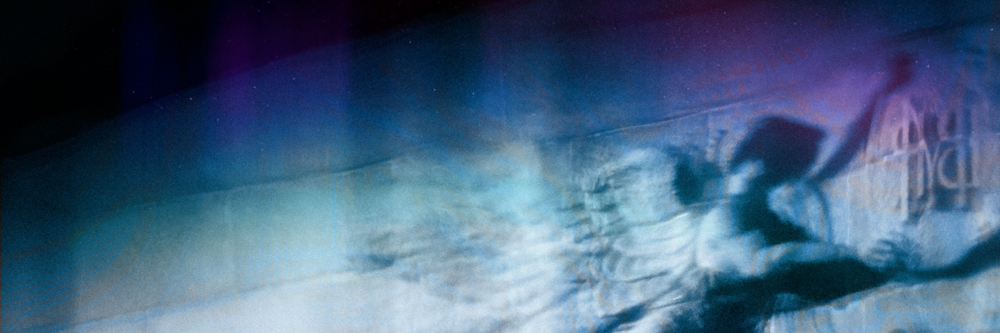

# Музыка

Мне интересен живой и текстурный звук — зернистый, как аналоговый фотоснимок. И музыка, которая словно сжимает воспоминание о чём-то давно забытом до ёмкого и целостного образа.

В этом музыка и кино схожи: композиция — это, в первую очередь, монтаж, редактура, работа с пространством и ритмом. Иными словами, режиссура.

Здесь собраны фрагменты моих работ, в которых этот подход проявлен точнее всего.

### Aqua

<audio src="assets/aqua.wav" controls loop></audio>

### Солнечный ветер

<audio src="/projects/solar-wind/assets/solar-wind.wav" controls loop></audio>

### Xen

<audio src="assets/xen.wav" controls loop></audio>
