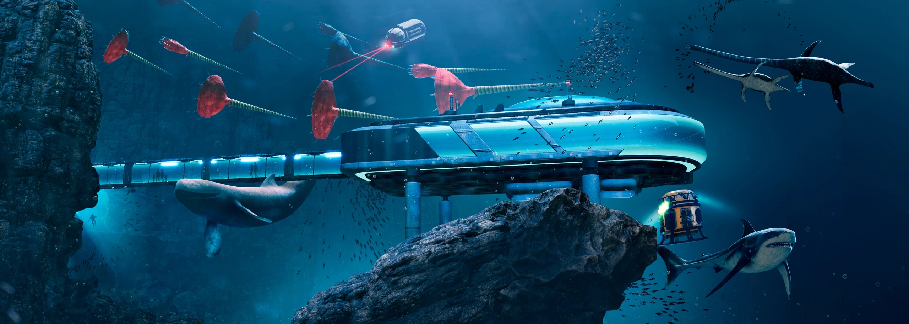

# Океан Юрского периода

*Интерактивная мультимедийная выставка*

**Роль:** Technical Designer / Lighting Artist

«Океан Юрского периода» — интерактивная выставка о жизни древнего океана в «Москвариуме» (Москва). Главной задачей было создать достоверную и убедительную иллюзию среды: точно передать масштабы обитателей и механику их поведения с учётом технических ограничений рендеринга реального времени.

Выставка разделена на несколько интерактивных зон. На старте я работал над зоной «Лаунж» — пространством с напольной и двумя настенными проекциями, которые соединяются в единую панораму. Здесь я создавал окружение, ставил свет, анимировал персонажей.

Затем перешёл к работе над общим пространством парка — отвечал за глобальный динамический свет, пост-обработку и визуальные эффекты, выстраивал единый и целостный образ выставки.
 
Самое приятное — видеть, что твоя работа вызывает у посетителей искренний эмоциональный отклик: совершенно иначе начинаешь воспринимать и сам проект, и свою роль в нём.

<a href="https://www.behance.net/gallery/122971265/Jurassic-Ocean-Immersive-Experience" target="_blank" rel="noopener noreferrer">behance.net ↗</a>

**Стек:** Unity, Maya
