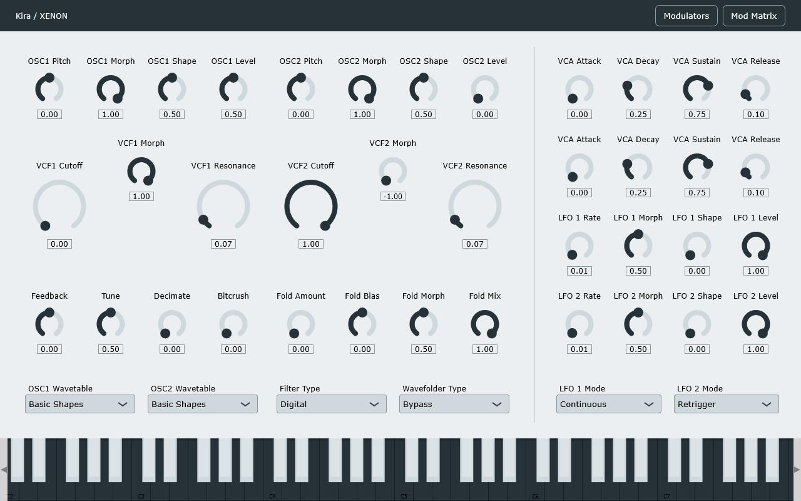

# Kira

*Гибридный синтезатор*

**Роль:** Technical Designer / DSP Engineer

Kira — синтезатор для аппаратной DSP-платформы и полумодульная композиционная среда для саунд-дизайна и саунд-арта.

Я проектирую высокопроизводительную архитектуру на основе Data-oriented design. Это позволяет движку выполнять вычисления per sample на повышенной внутренней частоте дискретизации (96 или 192 кГц).

Такая точность и минимальная латентность приближают цифровой сигнал к аналоговому тракту. При глубокой кросс-модуляции на аудиочастотах или работе с тональными задержками это даёт значительный эффект.

В процессе разработки я исследую математику и физику звука, алгоритмы синтеза и генерации. Главный приоритет — точность и предсказуемость звукового ядра вместе с расширенными звуковыми и композиционными возможностями.

**Стек:** C, C++
