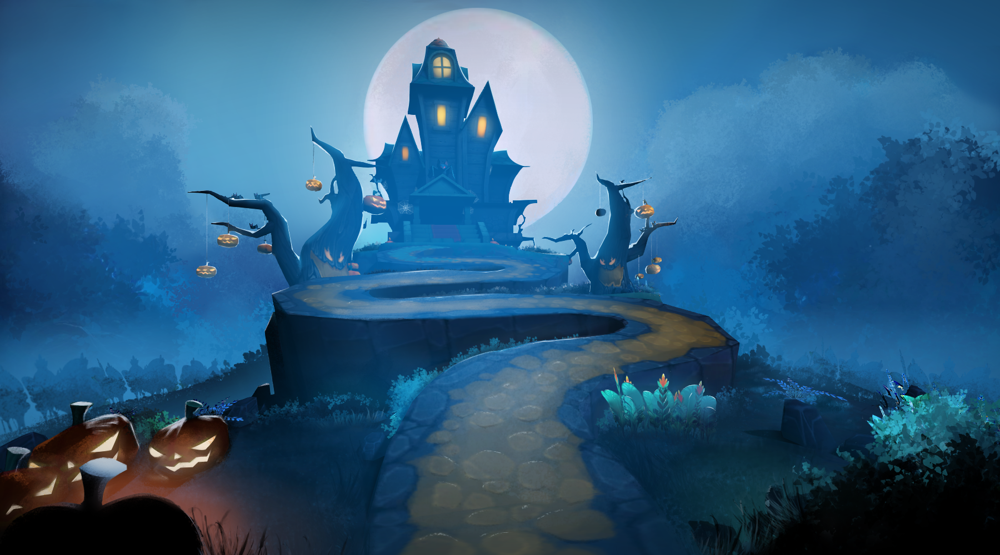

# Monster Smash & Blast

*Игра для аркадного автомата*

**Роль:** Technical Game Designer / Sound Designer

Самое интересное в Monster Smash & Blast — сочетание разных форм физической интеракции: игрокам нужно и бить по кнопкам, и стрелять из бластера, и прыгать по платформам. Это тактильный, по-настоящему осязаемый опыт — и мне хотелось, чтобы изображение и звук подчёркивали это ощущение.

В игре несколько уровней: с каждым этапом противники становятся агрессивнее, а их поведение — сложнее. Финал — поединок с боссом.

*Концепт-арт, который я создал в пре-продакшне как визуальный эталон для команды*

Сначала я руководил разработкой проекта, затем перешёл к геймдизайну и коду — проектировал архитектуру, придумывал и создавал новые механики и системы на C#.

Также я создал звуковые эффекты и интегрировал их в игру.

**Стек:** Unity, C#, Blender
