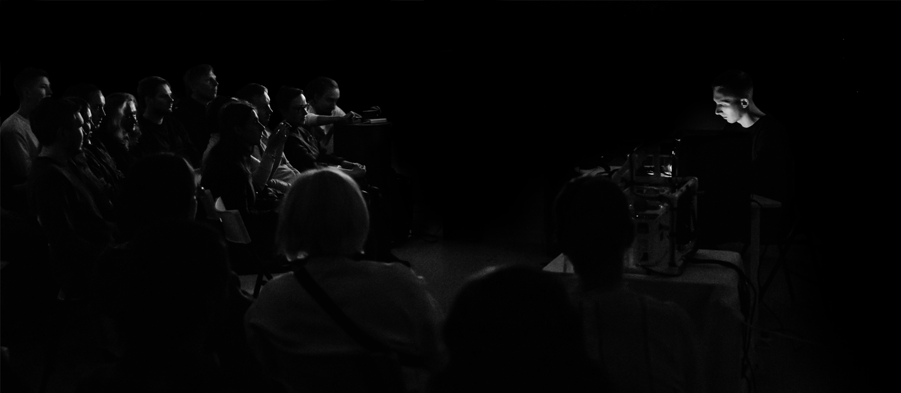

# Северный город

*Электроакустический концерт*

Подготовил и исполнил электроакустический концерт в галерее «Краснохолмская» на «Ночи искусств» (Москва, 2024).

В этом проекте я искал баланс между импровизацией и подготовленной структурой. Я готовил лайв-сет как пространство возможностей — гибкую среду из сэмплов, midi-клипов и полноценных инструментов для живой игры.

Затем я тестировал эту концепцию на практике: играл лайвы, проверял новые идеи, оставлял рабочие решения и отсекал лишнее. Чтобы получить полный контроль, большую часть тембров я синтезировал в реальном времени. Но также я активно использовал сэмплы.

Чтобы сделать общее звучание осязаемым и «физическим», я намеренно вводил акустические тембры — медные духовые или струнные фактуры. Я смешивал их с электронными тембрами, создавал отдельные звучания и полноценные сэмплерные инструменты, которые находятся на стыке акустического и электронного.

<a href="https://kholmy.vzmoscow.ru/artnight24" target="_blank" rel="noopener noreferrer">kholmy.vzmoscow.ru ↗</a>

<audio src="assets/northern-city.wav" controls loop></audio>
